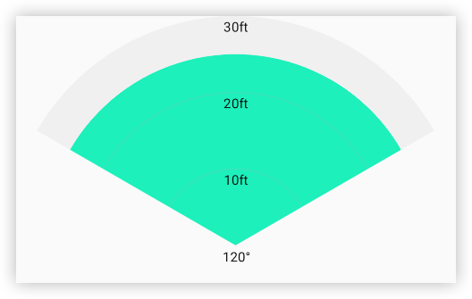

# 自定义View项目

## PieChartView 扇形进度图



### xml 中使用方法

````
<com.gentle.customview.widget.PieChartView
    android:id="@+id/chartView"
    android:paddingTop="20dp"
    android:layout_width="match_parent"
    android:layout_height="200dp"
    app:angle="120"
    app:maxValue="30"
    app:progress="5"
    app:labelNum="3"
    app:showAngleText="true"
    app:labelTextSize="12sp"
    android:background="#CCCCCC" />

````
